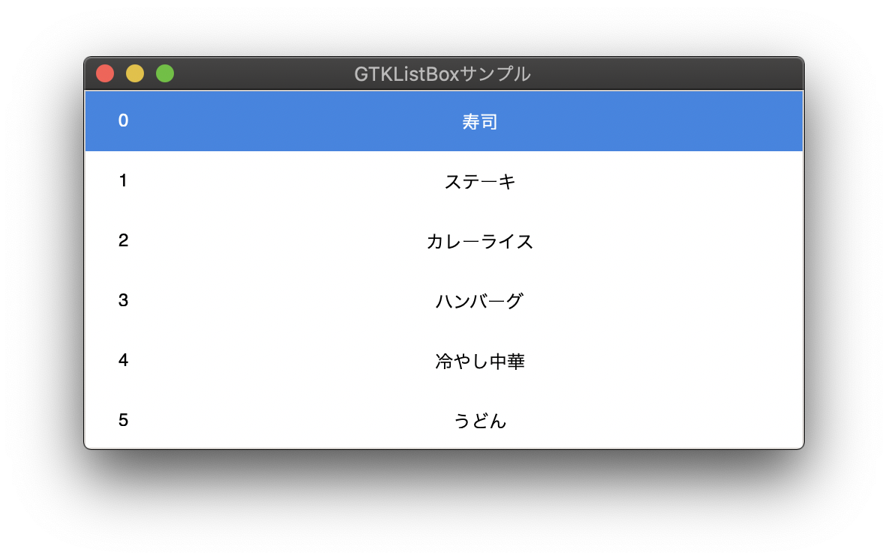

GTK3 examples

GTK3 Cソースコードのサンプルプログラム集です。
GTKを利用したGUI開発で必要になりそうな内容を大まかに網羅しています。

## hello-world

Hello Worldのサンプルコードです。ウインドウの生成やラベル追加など最も基本的な内容です。

## image-viewer-with-glade

簡易画像ビューアアプリケーションのサンプルコードです。
こちらは、Gladeデザインツールを利用して作成した画面のxmlファイルを読み込んでいます。

## cairo

2Dグラフィックスライブラリのcairoを利用した簡易ペイントのサンプルです。

## opengl

3DグラフィックスライブラリのOpenGLを利用したシェーダプログラムのサンプルです。
シェーダ部分はGTK3デモアプリケーションのソースコードをそのまま利用しています。

## thread

GLibのg_threadを利用した、画面のカウンタ値を1秒間隔でカウントアップするだけのサンプルです。

## timer

上記threadサンプルプログラムの内容をスレッドの代わりにタイマーを利用したサンプルです。

## webview

WebKitGtkを利用したWebview (HTML5コンテンツの表示) アプリケーションのサンプルです。

## style

スタイルシート (CSS) を用いたウィジェットのデザイン設定のサンプルです。

## localize

GTKの多言語対応サンプルコードです。

## custom-widget

独自定義のウィジェットを作成し、リストボックスで表示するサンプルコードです。

